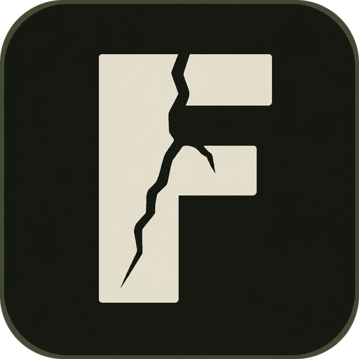

# FISSURE

### AI Stem Splitter for Mac
**Split any track into vocals, drums, bass, and more — fully offline, no subscription.**

---

## What is Fissure?

Fissure uses state-of-the-art AI to separate any audio file into individual stems in minutes — right on your Mac. No internet required after the first launch. Your audio never leaves your machine.

Drop in a track. Choose your mode. Drag your stems straight into your DAW.

---

## Screenshots

### Drop Zone & Mode Selection

### Stem Output

### History Sidebar

---

## Features

- **3 Separation Modes**
  - **4-Stem** — Vocals · Drums · Bass · Other. Fast, general purpose.
  - **6-Stem** — Vocals · Drums · Bass · Guitar · Piano · Other. Live instrument focus.
  - **Vocal Priority** — Cleanest possible vocal isolation using MDX-Net.

- **100% Offline** — All processing happens locally on your Mac. No data sent anywhere, ever.
- **Universal Binary** — Runs natively on Apple Silicon (M1/M2/M3/M4) and Intel Macs.
- **Drag to DAW** — Drag stems directly from Fissure into Ableton, Logic, Pro Tools, or any DAW.
- **Auto Analysis** — BPM, key, and bar count detected automatically when you load a file.
- **Separation History** — Revisit and replay past sessions at any time.
- **Clean Producer UI** — Dark, distraction-free interface built for music makers.

---

## System Requirements

| | |
|---|---|
| **OS** | macOS 12 Ventura or later |
| **Architecture** | Apple Silicon or Intel |
| **Disk Space** | ~600 MB (AI models download once on first launch) |
| **Internet** | Required only for first launch model download |

---

## Download

**[→ Get Fissure on Gumroad (Free)](https://terraecho.gumroad.com/l/rlpqdr)**

---

## Installation

1. Download the DMG from Gumroad
2. Open the DMG and drag **Fissure** to your Applications folder
3. On first launch, macOS will block the app — this is normal for indie apps

**First launch security steps:**
1. Double-click Fissure — click **Done** on the warning (not Move to Trash)
2. Go to **System Settings → Privacy & Security**
3. Scroll to Security — click **Open Anyway** next to Fissure
4. Enter your Mac password when prompted
5. Click **Open Anyway** on the final dialog

You only need to do this once.

---

## How It Works

1. Drop in any audio file (WAV, MP3, FLAC, AIFF, M4A)
2. Choose your separation mode — 4-Stem, 6-Stem, or Vocal Priority
3. Hit **Split Stems** and wait for the AI to process
4. Play back each stem individually, then drag them straight into your DAW

---

## About

Fissure is built by **[Terra Echo Studios](https://terraecho.gumroad.com)**.

Questions or issues? Email: willhall.wch@gmail.com

---

FISSURE v1.0.0 // TERRA ECHO STUDIOS

